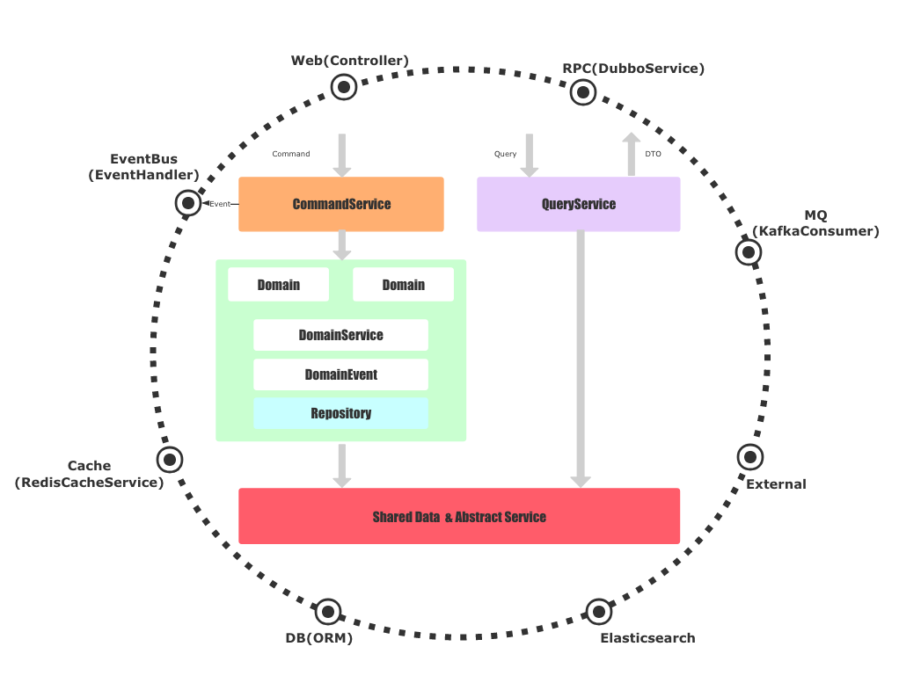
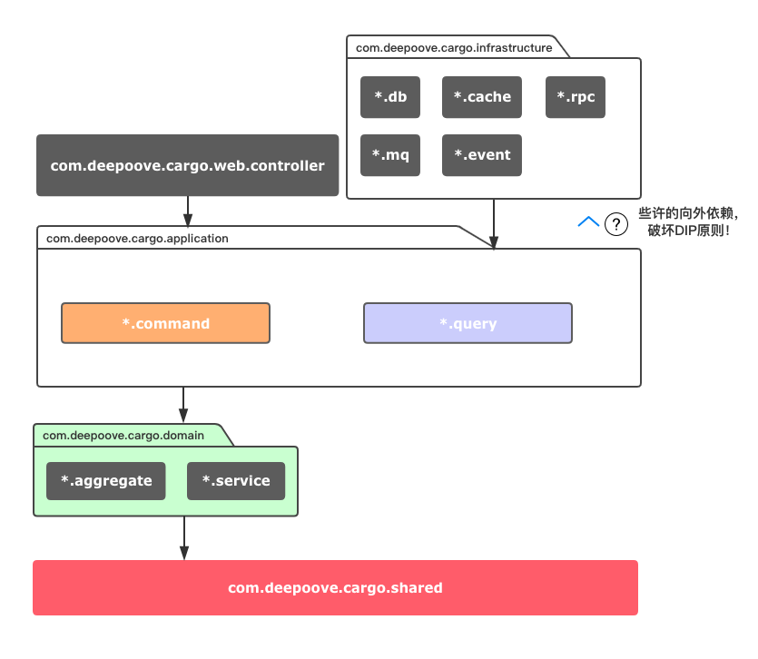
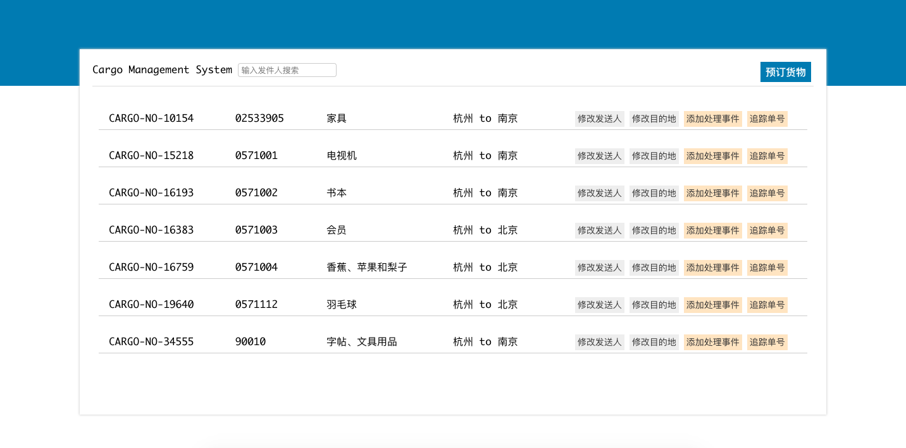
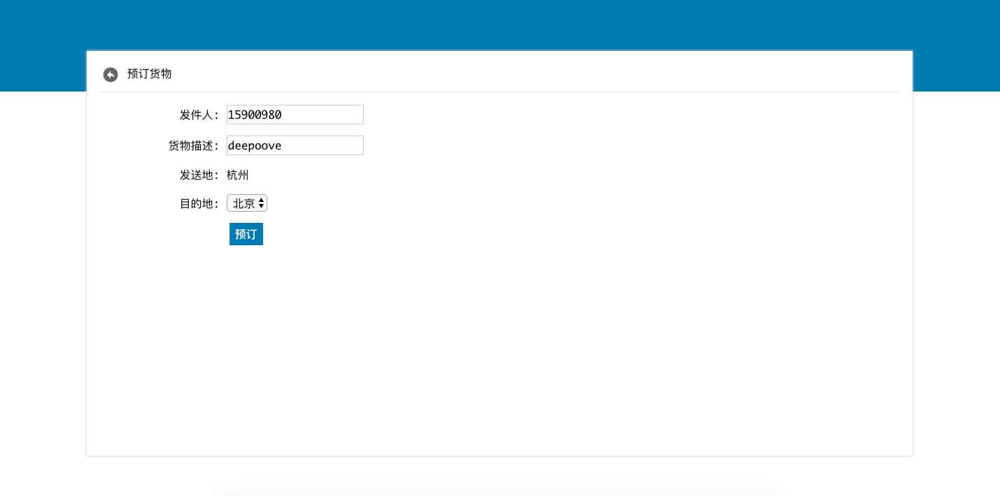
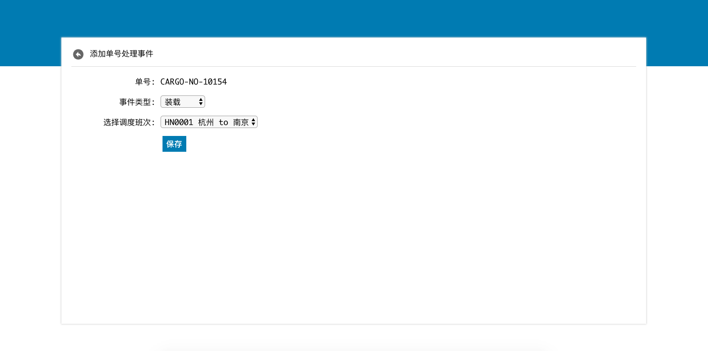
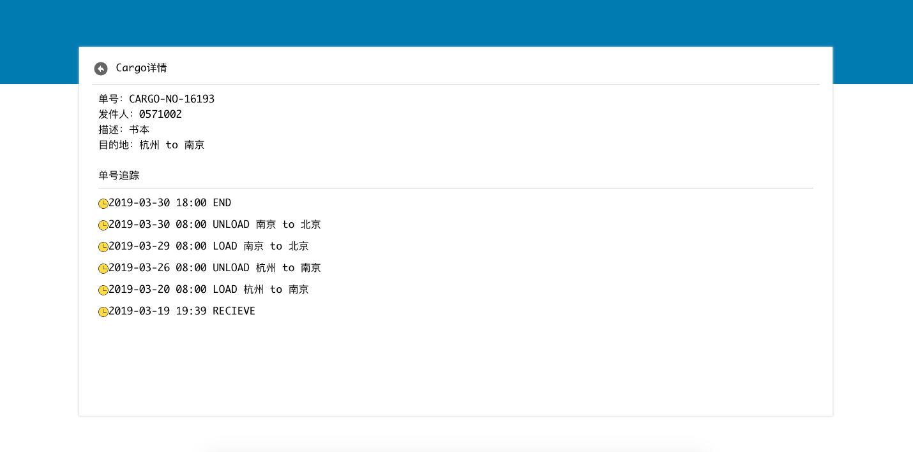

# ddd-cargo
领域驱动货物需求示例

## 需求-节选自《领域驱动设计第7章》
假设我们正在为一家货运公司开发新的软件，最初的需求包括三项基本功能：
1. 事先预约货物
2. 跟踪客户货物的主要处理流程
3. 当货物到达其处理过程中的某个位置时，自动向客户寄送发票

## DDD、CQRS架构图

## DDD、CQRS代码结构

## 示例
ddd-cargo-example是一个单Maven模块的项目，DDD+CQRS落地示例，基于SpringBoot开发。

下面我们以ddd-cargo-example为例来演示如何落地：

1. 修改`/ddd-cargo-example/src/main/resources/application.properties`数据库连接

2. 初始化数据库脚本文件`/ddd-cargo-example/mysql_init.sql`

3. 运行`/ddd-cargo-example/src/main/java/com/deepoove/cargo/CargoApplication.java`

4. 浏览器访问`http://127.0.0.1:8077/index.html`

#### 查询Cargo

#### 预订Cargo

#### Cargo事件

#### 追踪Cargo

## 文章
Blog：[领域驱动设计DDD和CQRS落地](http://deepoove.com/blog/#/posts/69)

